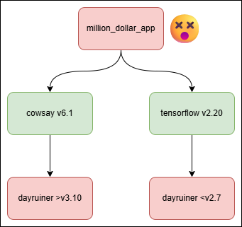
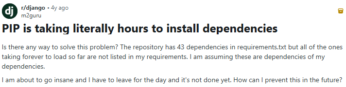
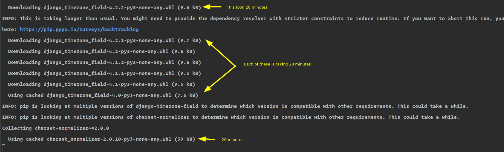
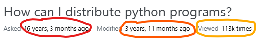
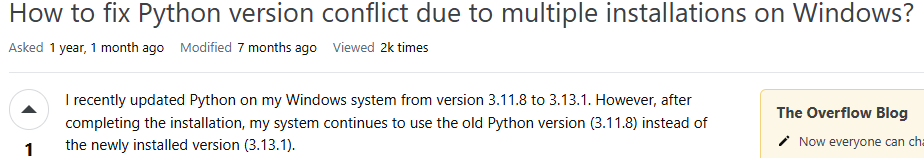
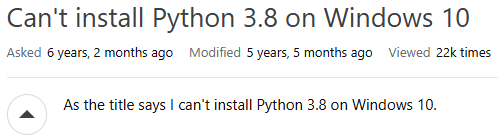
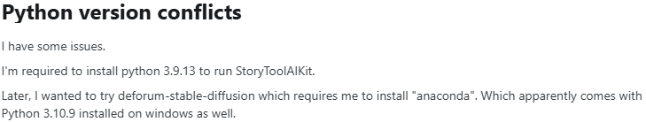
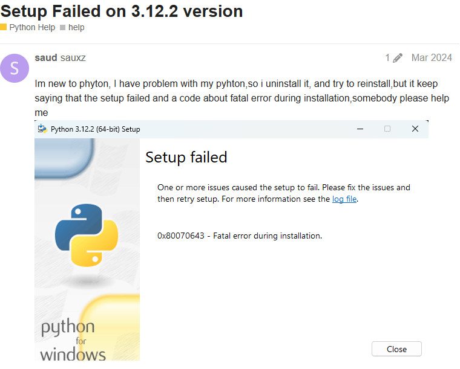

<h1>🐍 Modern Python Dependency Management With UV 🚀</h1>

---

<style scoped>
ul {
  font-size: 20px;
}
</style>

<h2>📚 Table of Contents 📚 </h2>

- [1. 👋 Intro 👋](#1--intro-)
  - [1.1. 🤓 Me 🤓](#11--me-)
  - [1.2. ☀️ UV ☀️](#12-️-uv-️)
- [2. 🤷‍♀️ What Is Dependency Management? 🤷‍♀️](#2-️-what-is-dependency-management-️)
  - [2.1. 🥀 What Did We Do Before UV? 🥀](#21--what-did-we-do-before-uv-)
    - [2.1.1. 🤮 Why This Sucks 🤮](#211--why-this-sucks-)
  - [2.2. 👀 What Do Other Languages Do? 👀](#22--what-do-other-languages-do-)
- [3. ✨ What UV Can Bring Us ✨](#3--what-uv-can-bring-us-)
  - [3.1. 🏃🏽‍♀️ SPEED 🏃🏽‍♀️](#31-️-speed-️)
  - [3.2. 🛠️ One Tool To Rule Them All 🛠️](#32-️-one-tool-to-rule-them-all-️)
  - [3.3. 🙂 Simplified Workflow 🙂](#33--simplified-workflow-)
  - [3.4. 📡 Distributability 📡](#34--distributability-)
  - [3.5. ✅ Correctness ✅](#35--correctness-)
- [4. 🔄 Migrating Old Projects 🔄](#4--migrating-old-projects-)
- [5. 🌱 New Project Setup 🌱](#5--new-project-setup-)

---

## 1. 👋 Intro 👋
### 1.1. 🤓 Me 🤓

> 
> 
> [Ollie Lavers](https://www.linkedin.com/in/hauteclere/)  
> She Codes Brisbane Masterclass Day  
> Saturday 2026.01.17  

---

### 1.2. ☀️ UV ☀️

[ UV is a new-ish dependency manager for Python.](https://docs.astral.sh/uv/)

 It is getting major (deserved) hype, and has completely revolutionised my toolset. 

We don't use it in She Codes, but **you should**. Here's why.

---

## 2. 🤷‍♀️ What Is Dependency Management? 🤷‍♀️


Dependency management is the work of obtaining and organising all of the code that we need for our projects that **we didn't write**.

- If you're coding a Django website, then Django is a dependency for your project, because your site can't work without the Django library.
- If you're coding an app in "pure Python", you still have dependencies - your app won't run without the Python interpreter!
- Even projects from compiled languages have dependencies that need to be managed during the build process.
- Dependencies shouldn't be installed globally!

---

### 2.1. 🥀 What Did We Do Before UV? 🥀
Python dependency management has historically been a total kludge.

You're probably familiar with the `pip` + `venv` + `requirements.txt` system that we teach at She Codes. With this toolset you would:

- Use the built-in `venv` library to create a "virtual environment". This "venv" contains a copy of the Python interpreter based on your global install that gets used to run your scripts, plus a folder for the library files that your project will depend on.
- Use the `pip` library to download and install dependencies from [the Python Package Index - "`PyPI`"](https://pypi.org/)
- Record your dependency library names + version numbers in a file, traditionally called "`requirements.txt`". 
  
---

Example requirements.txt:
  ```txt
  asgiref==3.11.0
  django==6.0.1
  django-neomodel==0.2.0
  neo4j==5.19.0
  neobolt==1.7.17
  neomodel==5.3.3
  python-dotenv==1.2.1
  pytz==2025.2
  six==1.17.0
  sqlparse==0.5.5
  typing-extensions==4.15.0
  ```

---

Example commands:

```bash
# Create a venv
python3 -m venv venv
```

```bash
# Activate the venv
source ./venv/bin/activate
```

```bash
# install dependencies
python3 -m pip install -r requirements.txt
```

---

#### 2.1.1. 🤮 Why This Sucks 🤮

- Risk of globally installed dependencies
  

---

- Unmanaged Subdependencies
  

---

- Slow
  
  

---

- Hard to distribute
  

---

- Doesn't manage system software
  
  
  
  

---

  (this is not a new problem)
  

---

### 2.2. 👀 What Do Other Languages Do? 👀
> Let's look at Rust as an example

- install and manage compiler using `rustup` tool
- built-in package manager called `cargo`
- dependencies file (`Cargo.toml`) AND lockfile (`Cargo.lock`)
- every repo is an isolated build-area
  -> **no global packages** 

---

## 3. ✨ What UV Can Bring Us ✨

---

### 3.1. 🏃🏽‍♀️ SPEED 🏃🏽‍♀️

---

### 3.2. 🛠️ One Tool To Rule Them All 🛠️

---

### 3.3. 🙂 Simplified Workflow 🙂

---

### 3.4. 📡 Distributability 📡

---

### 3.5. ✅ Correctness ✅

---

## 4. 🔄 Migrating Old Projects 🔄

---

## 5. 🌱 New Project Setup 🌱

---

Fin.
